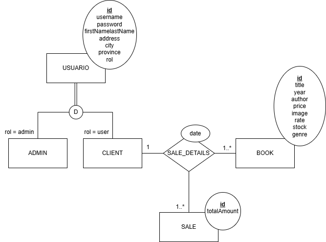

# TP DSW - Librería

## Grupo
| Legajo | Alumno          | E-Mail                          | GitHub        |
|--------|---------------|--------------------------------|--------------|
| 45785  | Tomás Frattín  | tomasfrattin@gmail.com         | @TomasFrattin   |

### Repositorios
* [FrontEnd](https://github.com/TomasFrattin/BookShopFrontEnd)
* [BackEnd](https://github.com/TomasFrattin/BookShopBackEnd)

## Tema
### Descripción
Ecommerce de libros que permite a los usuarios registrarse, explorar el catálogo, agregar libros al carrito y confirmar su compra, enviando así un mensaje al dueño de la librería para procesar el pedido. Además, cuenta con un apartado de administración donde se pueden realizar altas, bajas y modificaciones tanto de libros como de usuarios, facilitando la gestión de la tienda de manera eficiente e intuitiva.

### Modelo

## Alcance Funcional

| Req (CRUD)            | Detalle |
|----------------------|---------|
| **Usuarios**         |         |
| Crear (Registro)     | Creación de cuentas de usuario con información básica. Almacenamiento seguro de contraseñas mediante algoritmos de hash. |
| Leer (Inicio de Sesión) | Autenticación segura mediante tokens JWT. Acceso a funciones personalizadas según el rol del usuario. |
| Leer (Exploración de Productos) | Visualización de una lista de productos disponibles. Filtrado por rango de precios. |
| **Carrito de Compras** | |
| Crear/Actualizar (Agregar/Modificar) | Agregado de productos al carrito. Modificación y eliminación de productos. Cálculo del total de la compra. |
| **Proceso de Compra** | |
| Crear (Confirmación) | Completar información del usuario para la compra. Confirmación y registro de la orden. |
| **Administradores** | |
| Crear/Actualizar/Eliminar (Gestión de Productos) | Creación, edición y eliminación de libros. Asignación de categorías y precios. |
| Leer/Actualizar/Eliminar (Gestión de Usuarios) | Visualización, edición y eliminación de usuarios. |
| **Seguridad** | |
| Autenticación y Autorización | Uso de tokens JWT para asegurar rutas y funcionalidades según el rol. Acceso restringido a administradores. |
| Almacenamiento Seguro | Uso de Bcrypt para almacenamiento de contraseñas. |
| **Comunicación** | |
| Notificaciones | Integración con WhatsApp API para envío de mensajes de confirmación y notificaciones. |
| **Escalabilidad** | |
| Base de Datos | Uso de MySQL para almacenamiento de productos, usuarios y ventas. |
